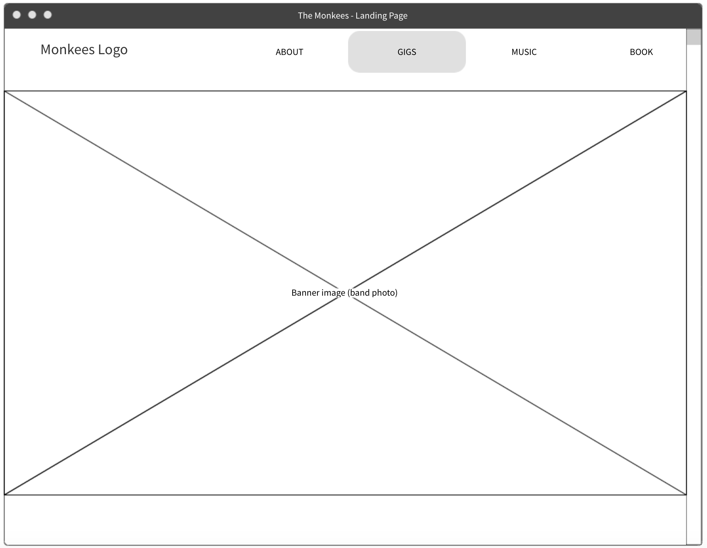
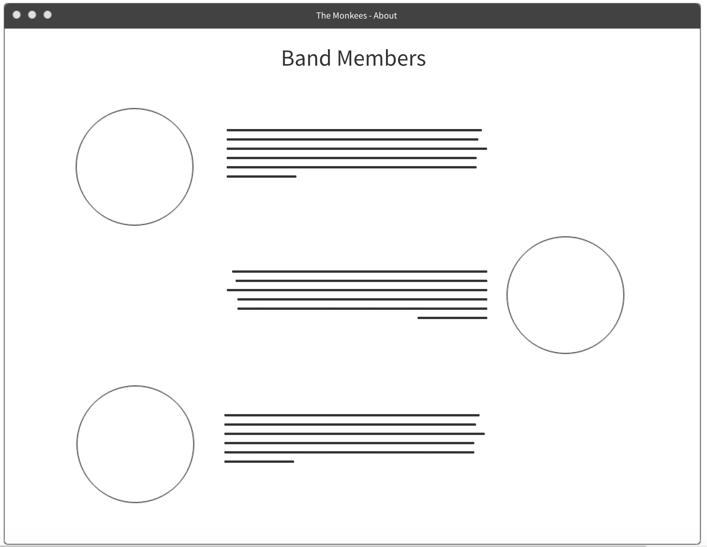
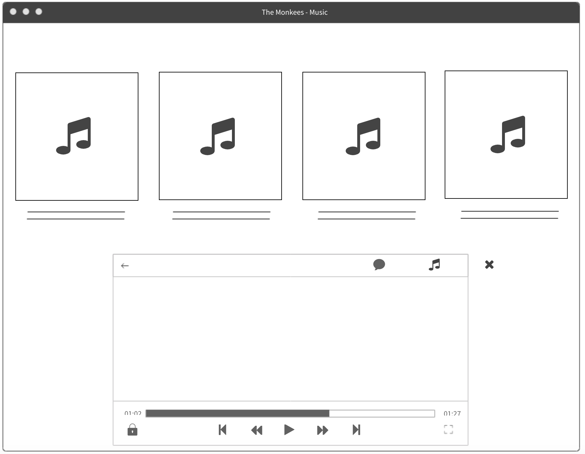
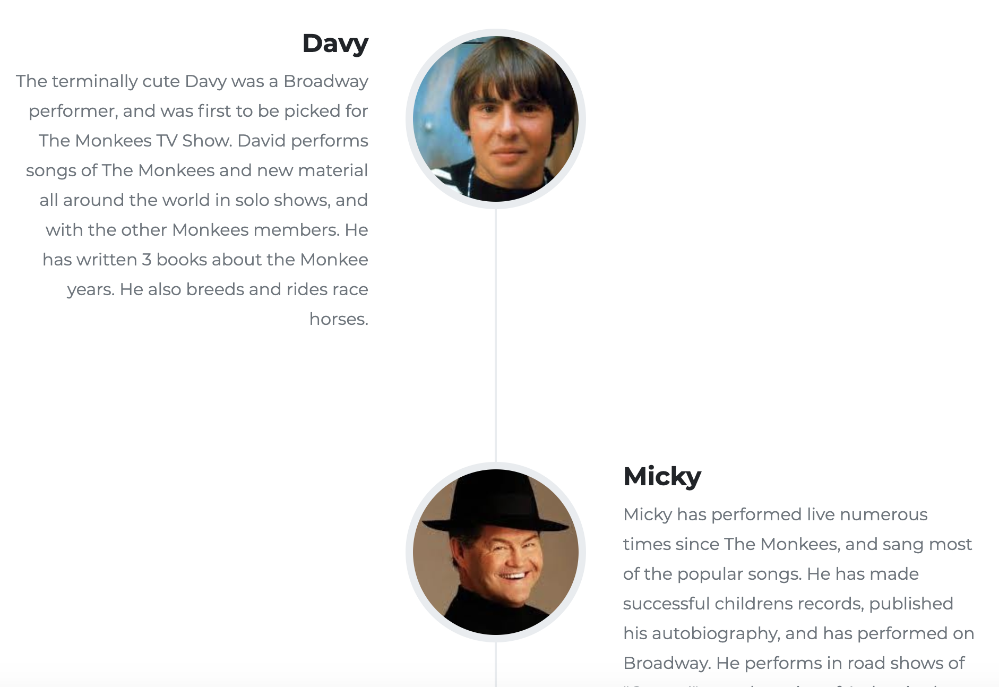
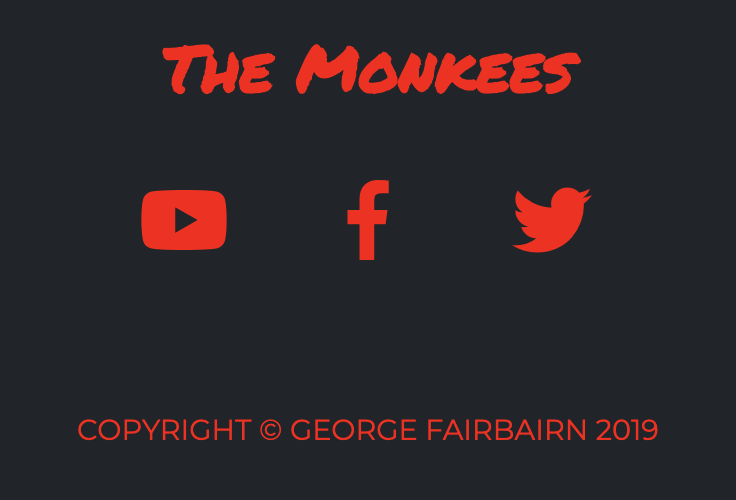

# The Monkees - Band Website

A website for The Monkees, a 60's band that have around 50 years experience of performing live at numerous events around the world. 

Using front-end technologies along with a clean, sleek design, fans and potential fans can:

- Find out more about the band members
- See upcoming live performances
- Listen to tracks from their back catalog
- Watch a famous music video
- Book The Monkees to perform at one of their own events

 
## Features and UX

Understanding that the band is from the 60's era, it was important to get the balance right between old and new. The general feel of the website is fresh and modern, but the logo font and main header picture were chosen with the old style in mind.

The website has been designed to have all the content on one page. In order to ensure the user was able to access each section of the website, without having to manually scroll, a fixed navbar was implemented with intelligent Jquery scroll-to-section clickable menu items.

The website packages everything a fan might want from The Monkees as a band. The audio section allows users to listen to a song, whilst continuing to visit other areas of the page (another benefit of having all the content on one page).

Although used in a different way from the norm, the timeline section used to display information about the band members makes the text visually appealing and entices the user to read on. The timeline feature was adjusted to work slightly differently on a smaller screen, but the visual appeal remains.

The live performance location section was also designed to behave differently on smaller screen sizes. The locations are stacked vertically on a mobile device or small screen, but spread horizontally across the page on a larger screen. Each performance location comes with it's own link to a website where tickets can be booked. The attribute `target="_blank"` opens the ticket booking website in another tab. This allows the user to be uninterrupted while on the band website page, and means that they can easily return to where they left off after purchasing tickets.

Initially an `<iframe>` tag was used to display the video content on the page. However, this caused a significant slowdown in the loading time of the website, so a `<video>` element was used instead. The user has full control on whether to play the video, and whether to play it full screen. Other options (similar to the audio elements on the page) to change the volume or download the content are also available in the video pane.

The user can send a request to book The Monkees at an event of their choice, by filling in the HTML `<form>` at the bottom of the page. This contains three `<input>` fields and a `<textarea>` field, each with placeholder text to guide the user on which information to put where.

Finally, the user is able to access each of the social media platforms that The Monkees are featured on by clicking on any of the social links at the bottom of the page. Again, the `target="_blank"` attribute opens the social media platform in another tab.

The footer colour scheme matches the header's for uniformity.

### Features Left to Implement

- The HTML form doesn't have HTTP POST functionality yet - an email to be sent on submission of the form would be a useful feature to implement next.

## Technologies Used

- [JQuery](https://jquery.com)
    - The project uses **JQuery** to simplify DOM manipulation - specific examples include collapsing of the navbar when the user is not at the top of the page, and the scroll-to-section functionality
    
- [Bootstrap 4](https://getbootstrap.com/)
    - The project uses the Bootstrap for styling purposes and achieving the grid layout
    
- [FontAwesome](https://fontawesome.com/)
    - The project uses FontAwesome for icons used - e.g. the links to social platforms
    
- [Google Fonts](https://fonts.google.com/)
    - The project used Google Fonts to beautify the typography

## Testing

1. ### Navbar and Header

    1. Click on the 'THE BAND' menu item, and the page auto scrolls to the `#band` section of the page
    2. Click on the 'LIVE' menu item, and the page auto scrolls to the `#live` section of the page
    3. Click on the 'AUDIO' menu item, and the page auto scrolls to the `#audio` section of the page
    4. Click on the 'VIDEO' menu item, and the page auto scrolls to the `#video` section of the page
    5. Click on the 'BOOK' menu item, and the page auto scrolls to the `#book` section of the page
    6. Click on the 'BOOK TICKETS' link on the header photo, and the page auto scrolls to the `#live` section of the page
    7. The navbar shrinks in size on scrolling from the top of the page and remains fixed at the top of the page.
    
2. ### Live

    1. Click on the 'BOOK TICKETS' link for Seattle, and be taken to the STG Presents website in a separate tab to book a ticket.
    2. Click on the 'BOOK TICKETS' link for Sacramento, and be taken to the B Street Theatre website in a separate tab to book a ticket.
    3. Click on the 'BOOK TICKETS' link for Hollywood, and be taken to the Troubadour website in a separate tab to book a ticket.
    4. Click on the 'BOOK TICKETS' link for New York, and be taken to the Ticketmaster website in a separate tab to book a ticket.
    
3. ### Listen

    1. Click on the 'Daydream Believer' song, and the modal allowing the user to play the song pops up.
    2. Click on the 'I'm A Believer' song, and the modal allowing the user to play the song pops up.
    3. Click on the 'Clarksville' song, and the modal allowing the user to play the song pops up.
    4. Click on the 'Stepping Stone' song, and the modal allowing the user to play the song pops up.
    5. Slide the volume slider and the volume turns up and down correctly.
    6. Click the download button and the user is prompted for the location to save the audio file.
    
    
4. ### Watch

    1. Pressing the play button loads the video file and the video begins playing.
    2. Clicking the expand button makes the video play in full-screen.
    3. Slide the volume slider and the volume turns up and down correctly.
    4. Click the download button and the user is prompted for the location to save the audio file.
    
    
5. ### Book

    1. Clicking on a user input fields results in that field coming into focus.
    2. The 'SEND REQUEST' button brings up a modal saying that the message has been successfully received.
    
    
6. ### Social Links
    
    1. Clicking the 'YouTube' icon takes the user to The Monkees YouTube channel in a separate tab.
    2. Clicking the 'Facebook' icon takes the user to The Monkees Facebook page in a separate tab.
    3. Clicking the 'Twitter' icon takes the user to The Monkees Twitter page in a separate tab.
    

## Deployment

The code has been deployed to GitHub

## Credits

The JQuery used to perform the scroll-to functionality in the project has been acquired from this [Bootstrap template](https://startbootstrap.com/themes/agency/)

### Content
- The text used for the descriptions of each of the band members was copied from the [Wikipedia article about The Monkees](https://en.wikipedia.org/wiki/The_Monkees)

### Media
The photos used in this site were obtained from:
    - [Pexels](https://www.pexels.com/royalty-free-images/)
    - The project brief [repository](https://github.com/Code-Institute-Org/project-assets)